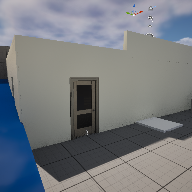

# Project Name  MyBPI

## Description

A github repository for the in class demonstration code. 
- blueprint instance editable variable 
- blueprint interface  
- material, master/instance 
- material, physics based rendered 
- material, world aligned 
 
WASD keys to navigate, F key to interact with doors, lift pad, lights, and gun 
 
## Usage
Clone, or download the zip, to a local directory. Open in Unreal Engine 5.4 or newer

## Attributions
1) brick wall material, FreePBR, ( https://freepbr.com/product/worn-out-old-brick-wall-pbr-material/ )

